## {#title-slide}

<h1 class="title">Efficient Coverage PlaybookComparing Predictive Uncertainty Across Model Classes for NFL Big Data Bowl Problems</h1>

  Jonathan Pipping-Gamón · University of Pennsylvania 
  Ron Yurko · Carnegie Mellon University

::: {.notes}
**Talk track.** Tracking data lets us ask extraordinary questions about a football play. The harder question is how much we can trust the answers when the independent sample is only a modest number of games. This talk offers a practical framework: accuracy, uncertainty, and stability.

**Timing.** 0:20.

[Sources]

- Title and authors: `abstract/cassis2026.tex`.
- Visual system adapted from Quang Nguyen's CMSACamp RevealJS theme and guidance for presentations built around assertions and evidence: `https://36-sure.github.io/2025/lectures/09-presentation.html`.
:::

## NFL tracking data {#the-nfl-big-data-bowl .tracking-intro-slide}

::: {.bdb-figure}
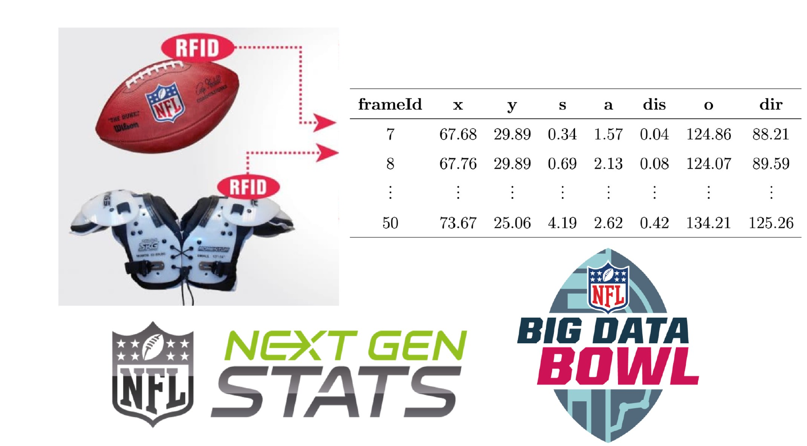{fig-alt="RFID chips in an NFL football and shoulder pads produce location and movement data for each frame used by Next Gen Stats and the NFL Big Data Bowl." width="94%"}

Player and football tracking features are reported at <strong>10 Hz</strong>.

:::

::: {.notes}
**Talk track.** The NFL Big Data Bowl is an annual modeling competition built around the league's player tracking data. RFID sensors record the football and every player ten times each second, producing position and movement variables for each frame. Each competition uses those data to study a different football prediction problem.

**Timing.** 0:35.

[Sources]

- NFL tracking program context: @nflbigdatabowl.
- Figure adapted from Slide 3 of Ron Yurko's `CMSAC intro and reading group.pptx`.
- 10 Hz sampling: `configs/bdb_suite/tasks/bdb2025_man_zone.json`.
:::

## Big Data Bowl problems, 2020–2025 {.figure-only}

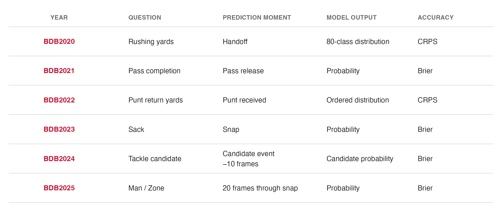{fig-alt="Six completed NFL tracking problems from BDB2020 through BDB2025, with their prediction moments, output forms, and primary accuracy scores." width="98%"}

::: {.notes}
**Talk track.** Across six completed competitions, the question changes from rushing yards to pass completion, punt returns, sacks, tackle candidates, and Man or Zone coverage. Some problems ask for a distribution and others ask for a probability. The prediction moment also changes from problem to problem. BDB2026 is not part of the completed evidence.

**Timing.** 0:35.

[Sources]

- Locked task definitions and anchors: `docs/bdb_suite/task_matrix.md` and `configs/bdb_suite/tasks/`.
- Completed evidence boundary: terminal BDB2020–BDB2025 receipts.
- Figure: `scripts/presentations/cassis2026/build_figures.R` / ggplot2.
:::

## The scale of Big Data Bowl datasets {.figure-only}

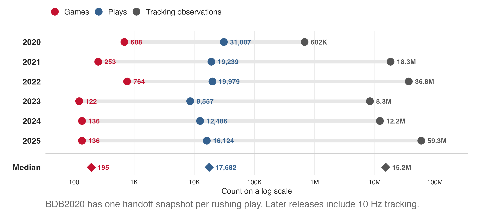{fig-alt="For each Big Data Bowl release from 2020 through 2025, a logarithmic scale connects the number of games, plays, and tracking observations. A final row shows medians of 195 games, 17,682 plays, and 15.2 million tracking observations." width="98%"}

::: {.notes}
**Talk track.** These releases contain millions of tracking observations, but the rows are nested inside plays and games. The median release has about 17,700 plays from 195 games. Those dependencies matter. We split, calibrate, and compare at the game level, so the effective sample for this study is much closer to the game count than the row count.

**Timing.** 0:40.

[Sources]

- Raw release counts: `configs/bdb_suite/sources/bdb2021_import.json`, `bdb2022_import.json`, `bdb2024_import.json`, and local source trees with verified checksums for BDB2023 and BDB2025.
- BDB2020 counts: `data/raw/train.csv` and `configs/bdb_suite/tasks/bdb2020_rushing_harmonized.json`.
- Figure: `scripts/presentations/cassis2026/build_figures.R` / ggplot2.
:::

## How do we evaluate predictive performance? {.evaluation-framework}

Accuracy

<strong>How closely do predictions match outcomes?</strong>

Proper loss functions compare predicted probabilities or distributions with observed outcomes.

Uncertainty

<strong>What outcomes remain plausible for this play?</strong>

Prediction intervals or sets quantify uncertainty for a future outcome.

Stability

<strong>Would another sample of games change model estimates or rankings?</strong>

Repeated game splits measure variation in predictive performance and model rankings.

::: {.notes}
**Talk track.** Accuracy is the usual starting point and the usual justification for a new model. It does not describe the range of plausible outcomes for an individual prediction. That is the role of uncertainty quantification. It also does not tell us how much the estimated performance would move under another plausible sample. That is predictive stability, or model variance. Uncertainty and stability are connected because both ask what one fitted result leaves unresolved, but they refer to different sources of variation.

**Transition from stability.** We also vary the number of training games to see how these measures change with sample size.

**Timing.** 0:55.

[Sources]

- Study framework: `paper/methods-brief.tex` and `abstract/cassis2026.tex`.
:::

## BDB2020: Rushing yards at handoff

What is the distribution of a runner's eventual yardage?

Prediction time
<strong>Handoff</strong>

The recorded handoff frame, before the run develops.

→

Model input
<strong>Player tracking + play context</strong>

All 22 players and information known at handoff.

→

Prediction
<strong>A probability distribution over yards</strong>

One probability for each possible gain.

::: {.notes}
**Talk track.** Start with the 2020 rushing problem. At handoff, the model sees all 22 players and the play context available at that moment. It predicts a probability distribution across 80 possible yardage outcomes. We evaluate that distribution with CRPS. Lower CRPS means the predicted distribution places more probability near what actually happened.

**Timing.** 0:35.

[Sources]

- BDB2020 task definition, cohort, and outcome support: `configs/bdb_suite/tasks/bdb2020_rushing_harmonized.json`.
- Terminal run: `data/bdb_suite_runs/definitive/bdb2020_rushing_harmonized/full100/`.
:::

## A rushing yard prediction for one play {.rushing-example-slide}

:::: {.columns .rushing-example-columns}
::: {.column width="42%"}
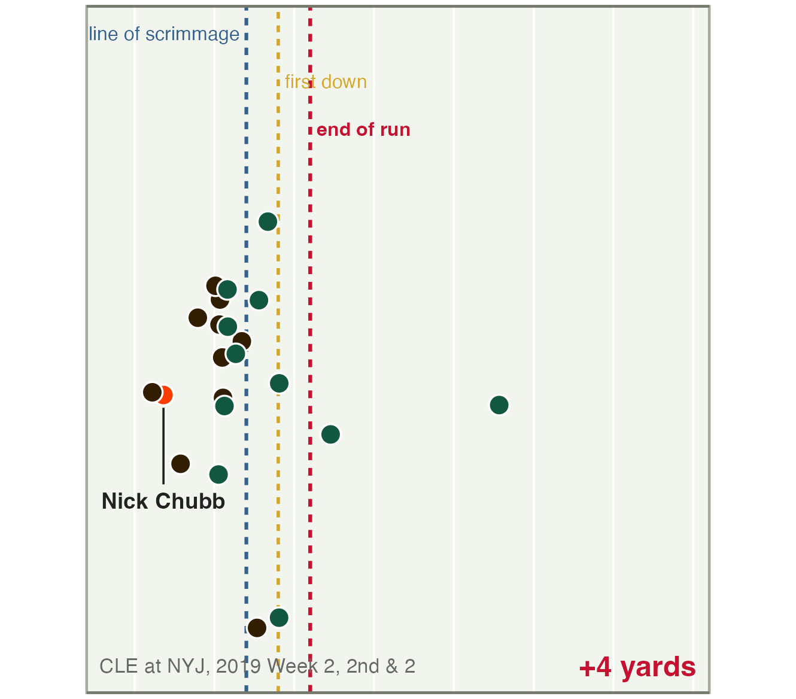{fig-alt="Nick Chubb at handoff against the Jets, with the line of scrimmage, line to gain, and end of a run that gained four yards marked." width="100%"}
:::

::: {.column width="58%"}
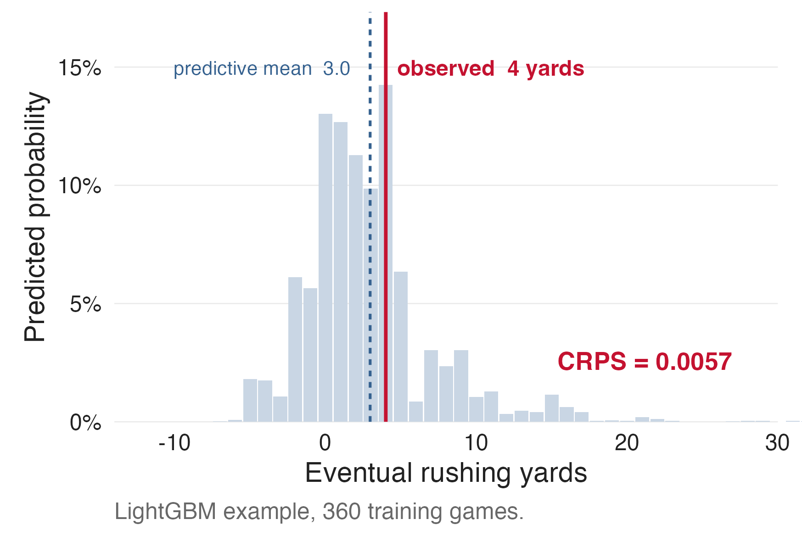{fig-alt="A predicted probability distribution for Nick Chubb's eventual rushing yards. Its mean is 3.0 yards and the observed outcome is 4 yards." width="100%"}
:::
::::

CRPS scores the full predicted distribution. Lower values indicate better predictions.

::: {.notes}
**Talk track.** This is Nick Chubb against the Jets in Week 2 of 2019. We freeze the play at handoff and feed the model the locations and movement of all 22 players plus the play context. The model assigns probability to every possible gain. Chubb gains four yards, close to the predicted mean of three. CRPS scores the full distribution, not only that mean. This Chubb example is our worked illustration; the aggregate results later come from the new harmonized run with five models.

**Timing.** 0:55.

[Sources]

- Raw play: `data/raw/train.csv`, Game 2019091600, Play 20190916000078.
- Predictions: `data/examples/bdb2020_chubb_predictions.csv`.
- Provenance: `data/examples/bdb2020_chubb_provenance.json`.
- Figures: `scripts/presentations/cassis2026/build_figures.R` / ggplot2.
:::

## Model features at handoff {.representation-slide}

:::: {.two-view .representation-views}
::: {.view-block .fragment data-fragment-index="0"}
Engineered football features

Positions, motion, distances, and game context summarized into one table.

Used by regularized regression and boosted trees.

**Tradeoff:** compact and easier to fit, but the analyst chooses the football structure in advance.
:::

::: {.view-block .red-line .fragment data-fragment-index="1"}
Raw player tracking

Each player's position and movement at handoff.

Used by relational and attention models.

**Tradeoff:** preserves more detail, but the model must learn more structure from the same games.
:::
::::

::: {.notes}
**Talk track.** The models receive the same permissible football information in two forms. The tabular models use deterministic summaries of position, motion, distances, and context. The neural models use tracking for every player at every frame. Feature engineering makes the input compact and places football assumptions up front. Tracking preserves more detail, but it asks a flexible model to learn useful structure from a modest number of independent games.

**Timing.** 0:45.

[Sources]

- Feature construction: `bdb_study/representations.py`.
- Channels and context for each task: `configs/bdb_suite/tasks/`.
:::

## Model classes across football problems

  
Model class

Input

Estimator

  
Regularized regression

Engineered football features

Penalized linear or logistic model

  
Boosted trees

The same engineered features

Gradient boosted decision trees

  
Relational network

Tracking + a football graph

Shared pairwise MLP with averaged messages

  
Attention relational network

The same tracking and graph

Shared pairwise MLP with learned message weights

  
Sumer Transformer

Tracking without a specified graph

Attention across players and observed frames

The same five model classes are fit for every Big Data Bowl problem.

::: {.notes}
**Talk track.** We compare the same five model classes in every problem. Regularized regression and boosted trees use the same engineered football features. That comparison changes the fitting algorithm while holding the inputs fixed. The three neural models use the same player tracking. RelNet and AttnRelNet require a football graph; the Sumer Transformer lets every observed player interact without specifying that graph in advance.

**Timing.** 0:45.

[Sources]

- Harmonized model panel: `configs/bdb_suite/tasks/bdb2020_rushing_harmonized.json` and `bdb_study/models.py`.
:::

## Split conformal prediction intervals {.split-conformal-slide}

Leverage <strong>calibration games</strong> to determine intervals without refitting.

  
01<strong>Fit the model</strong>
Fit on training games, then keep the prediction model fixed.

  
02<strong>Score held-out plays</strong>
Use separate calibration games to score disagreement between predictions and outcomes.

  
03<strong>Set a threshold</strong>
Take a high quantile of the calibration scores for the desired coverage.

  
04<strong>Form the interval</strong>
For a new play, include outcomes whose scores do not exceed the threshold.

::: {.notes}
**Talk track.** Conformal inference gives us a common way to attach uncertainty to predictions from different algorithms. Training games fit the prediction model. Calibration games are separate games that were not used to fit it. Once the model is fitted, it stays fixed while we score predictions against observed outcomes in those calibration games. Larger scores mean greater disagreement, and the score depends on the problem. A finite-sample quantile of the calibration scores gives the threshold for the desired coverage. For a new play, evaluate possible outcomes and include those whose scores do not exceed the threshold. With the rushing score on the next slide, this becomes padding added to the model's central interval. The calibration step changes the interval without refitting the prediction model. The coverage interpretation relies on exchangeability at the calibration unit, with the game-based design and qualifications in the backup.

**Timing.** 1:00.

[Sources]

- Split conformal overview: @angelopoulos2023conformal.
- Calibration design by game: `paper/methods-brief.tex`.
:::

## Split conformal intervals for rushing yards {.rushing-calibration-slide}

:::: {.columns .calibration-example}
::: {.column width="70%"}

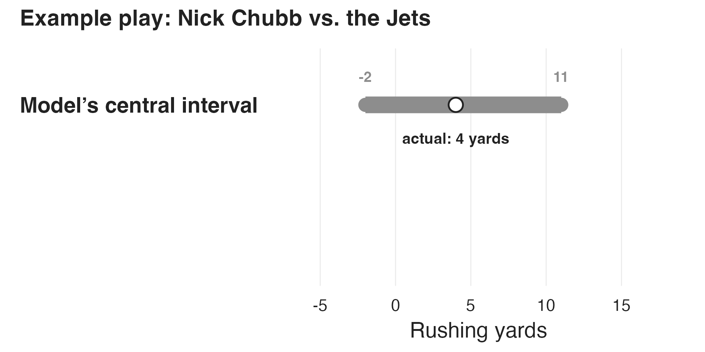
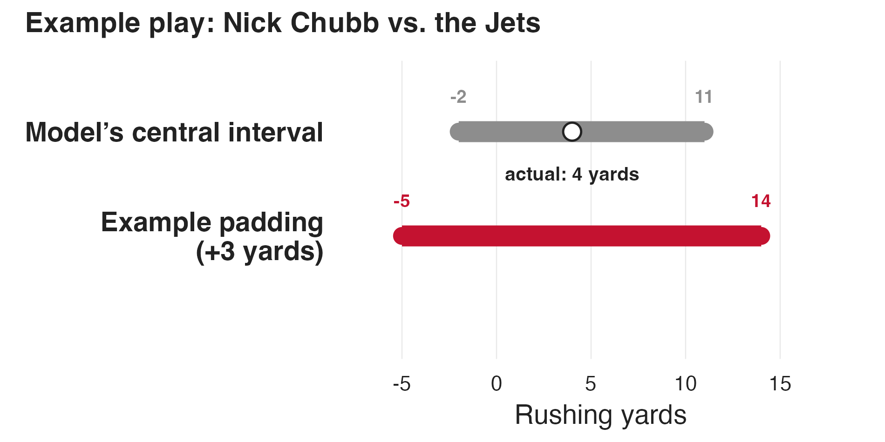

:::
::: {.column .interval-steps width="30%"}

<h3>Calibration</h3>
For one eligible play per held-out game, record the yards beyond the central interval (0 inside it).

<h3>Padding</h3>
The finite-sample quantile for 90% coverage gives the allowance added to both endpoints.

:::
::::

::: {.notes}
**Talk track.** Start with the model's central interval. From each separate calibration game, select one eligible play and record how far its outcome fell outside that interval. The finite-sample conformal quantile for 90% coverage gives one allowance per fitted model and repetition. To illustrate the arithmetic on the Chubb prediction, an allowance of three yards would expand both endpoints from minus two and eleven to minus five and fourteen. The value of three yards is an arithmetic illustration here, not an estimate from the terminal harmonized run. The saved Chubb example originally used a different local weighting procedure tailored to each play.

**Timing.** 1:00.

[Sources]

- Conformal overview: @angelopoulos2023conformal.
- Terminal BDB2020 calibration design: `configs/bdb_suite/tasks/bdb2020_rushing_harmonized.json`.
- Values for the example play: `data/examples/bdb2020_chubb_predictions.csv`.
- Figure: `scripts/presentations/cassis2026/build_figures.R` / ggplot2.
:::

## Game splits and predictive stability {.figure-only}

::: {.sample-size-repetitions}

We reshuffle the games in each repetition and fit every model at six training sample sizes.

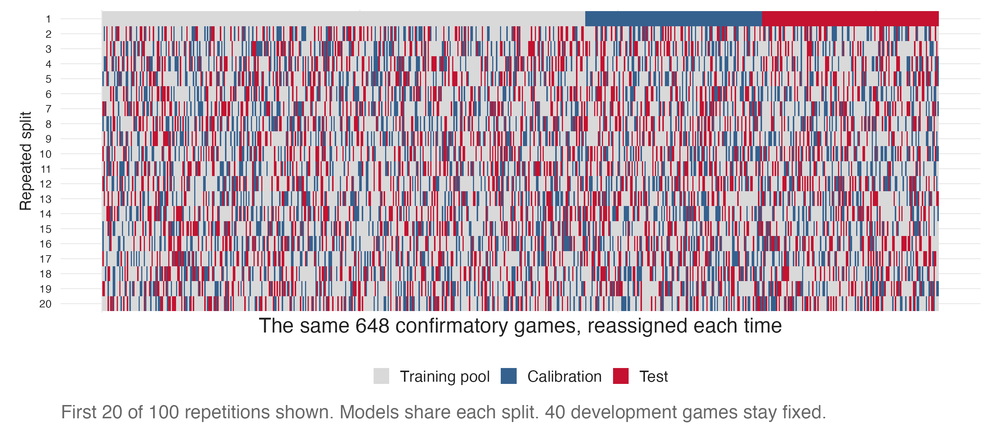{fig-alt="Actual game assignments for the first 20 of 100 complete BDB2020 repetitions, with 648 confirmatory games reassigned among training, calibration, and test sets." width="97%"}
:::

::: {.notes}
**Talk track.** To measure stability, we repeat the entire procedure by game 100 times. Every repetition redraws the training, calibration, and test games from the 648 confirmatory games; 40 development games remain fixed outside the comparison. Within a repetition, all models receive the same partition. This shows how performance and model rankings change across plausible samples. The ribbons from the 10th through 90th percentiles in later plots describe this procedural variation. They are not conformal intervals for a play and they do not decide whether one model beats another.

**Training sample size.** Within each split, we fit every model using 20, 40, 80, 160, 240, and 360 training games for rushing. These are nested subsets of the training pool. Calibration and test games stay the same across the six sizes within that repetition. Varying the number of training games measures the effect of sample size; repeating the splits measures variability across samples.

**Timing.** 0:45.

[Sources]

- Exact assignments: `data/bdb_suite_runs/definitive/bdb2020_rushing_harmonized/full100/manifest.json`.
- Figure: `scripts/presentations/cassis2026/build_figures.R` / ggplot2.
:::

## Comparing models across repetitions {.loss-comparison}

:::: {.comparison-stack}
::: {.comparison-row .fragment data-fragment-index="0"}
<h3>Paired loss differences</h3>

Models $A$ and $B$ use the same test games in repetition $r$. Write their mean test losses as $\bar L_{A,r}$ and $\bar L_{B,r}$.

$$
d_r=\bar L_{A,r}-\bar L_{B,r}
$$

A negative difference favors $A$.
:::

::: {.comparison-row .max-t-row .fragment data-fragment-index="1"}
<h3>Simultaneous comparisons</h3>

Compare every pair of models at each training sample size: **10 model pairs × 6 sample sizes = 60 comparisons.**

Resample the 100 repetitions jointly. The **90% max-t intervals** account for dependence across all 60 comparisons within each problem.
:::
::::

::: {.max-t-summary .fragment data-fragment-index="2"}
**Clear winner:** lower loss than all four alternatives at that training sample size under the paired 90% max-t intervals.
:::

::: {.notes}
**Talk track.** A clear winner does not come from whether the descriptive ribbons overlap. Within each repetition, models use the same test games, so we compare paired mean losses. Training sample size means the number of games used to train the model. Five models give ten model pairs, each compared at six training sample sizes within a problem. Each bootstrap draw resamples the complete vector of 60 comparisons, preserving their dependence. The nominal 90% intervals jointly control the probability of any false difference claim across the problem at about ten percent. A model is a clear winner at one training sample size only when all four paired intervals favor it.

**Timing.** 0:45.

[Sources]

- Inference provenance: `data/inference_90/provenance.json`, using the complete-repeat max-t method in `bdb_study/analysis.py` at 90% confidence.
- Presentation inference for all six problems: `data/inference_90/bdbYYYY/` and its checksum-bound provenance. Terminal fits and the original inference remain unchanged.
- Every BDB2020–2025 problem protects a family of 60 primary loss comparisons.
:::

## Rushing accuracy across sample sizes {.figure-only}

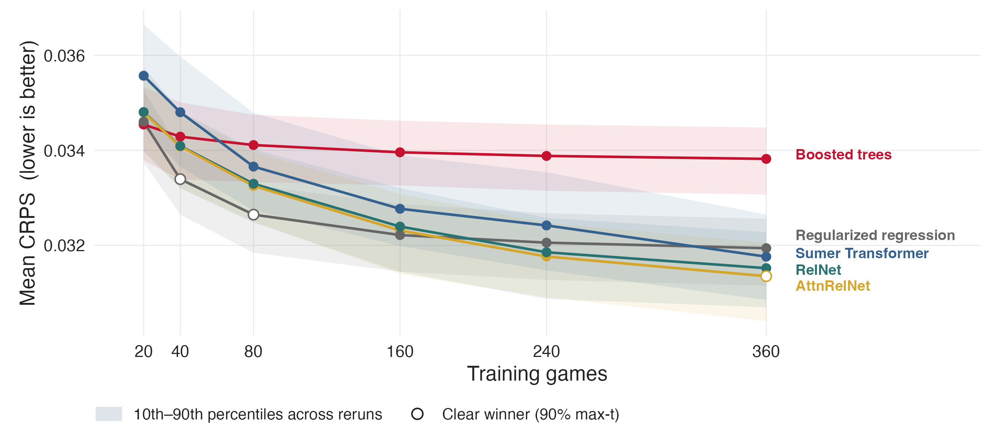{fig-alt="BDB2020 mean CRPS versus training games for five models across 100 complete repetitions. Boosted trees lead at 20 games, regularized regression at 40 through 160, and AttnRelNet at 240 and 360. Open circles mark clear winners at 40, 80, and 360 games." width="98%"}

::: {.notes}
**Talk track.** Rushing does not have one winner across every sample size. Boosted trees have the lowest mean CRPS at 20 games. Regularized regression leads from 40 through 160, and AttnRelNet leads at 240 and 360. The open circles show where the paired max-t comparison supports a clear winner: regularized regression at 40 and 80 games, and AttnRelNet at 360. The shaded bands from the 10th through 90th percentiles only describe variation across reruns.

**Timing.** 0:50.

[Sources]

- Means and rerun bands: `data/bdb_suite_runs/definitive/bdb2020_rushing_harmonized/full100/final/summary.csv`.
- Clear winner decisions: `data/inference_90/bdb2020/supported_best.csv`.
- Figure: `scripts/presentations/cassis2026/build_figures.R` / ggplot2.
:::

## Rushing interval coverage and width {.figure-only}

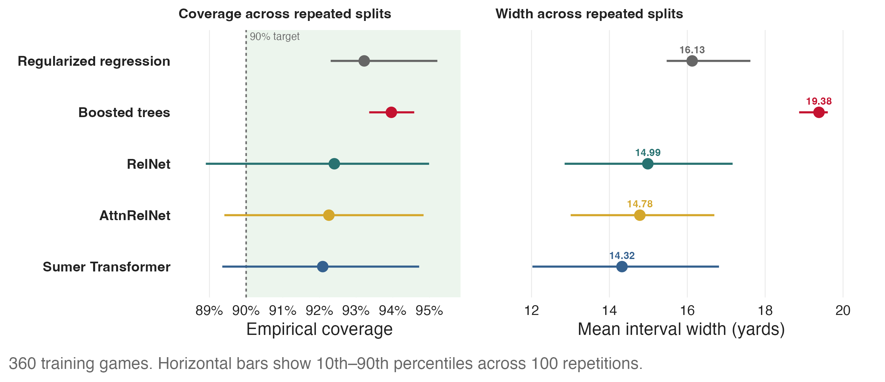{fig-alt="At 360 training games, empirical coverage and interval width for five rushing models. All five pass the simultaneous coverage gate. Sumer Transformer has the smallest observed mean width, but its paired comparison of interval widths with AttnRelNet includes zero." width="96%"}

::: {.notes}
**Talk track.** Accuracy does not settle the model choice. At 360 games, all five procedures have simultaneous 90% lower confidence bounds that meet the 90% coverage target. The Sumer Transformer has the smallest observed mean width at 14.32 yards, compared with 14.78 for AttnRelNet. The paired 90% max-t interval for AttnRelNet minus Sumer, a difference of 0.46 yards, runs from minus 0.09 to 1.00, so we cannot distinguish those two on width. Sumer is clearly narrower than regularized regression, boosted trees, and RelNet at valid coverage.

**Timing.** 0:50.

[Sources]

- Summaries: `data/bdb_suite_runs/definitive/bdb2020_rushing_harmonized/full100/final/summary.csv`.
- Coverage gate at 90% confidence and a 90% coverage target: `data/inference_90/bdb2020/coverage_lower_bounds.csv`.
- Controlled sharpness at 90% confidence: `data/inference_90/bdb2020/controlled_sharpness.csv`.
- Figure: `scripts/presentations/cassis2026/build_figures.R` / ggplot2.
:::

## BDB2020 model rankings by training sample size {#bdb2020-model-rankings-across-game-budgets .figure-only .completion-row-slide}

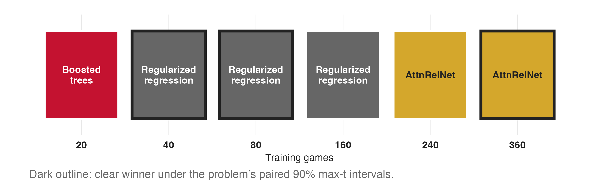{fig-alt="Across six BDB2020 training sample sizes, boosted trees have the lowest mean CRPS at 20 games, regularized regression at 40 through 160, and AttnRelNet at 240 and 360. Dark outlines mark clear winners at 40, 80, and 360 games." width="94%"}

::: {.notes}
**Talk track.** This compresses the rushing result into the display used on the next slide. Each number is the number of training games. Fill identifies the model with the lowest observed mean CRPS. A dark outline means all four paired 90% max-t intervals across the problem favor that model. The observed leader moves from boosted trees to regularized regression to AttnRelNet; only 40, 80, and 360 games produce a clear winner.

**Timing.** 0:25.

[Sources]

- Terminal BDB2020 metrics: `data/bdb_suite_runs/definitive/bdb2020_rushing_harmonized/full100/final/`. Paired inference at 90%: `data/inference_90/bdb2020/`.
- Figure: `scripts/presentations/cassis2026/build_figures.R` / ggplot2.
:::

## Model rankings across football problems {.figure-only}

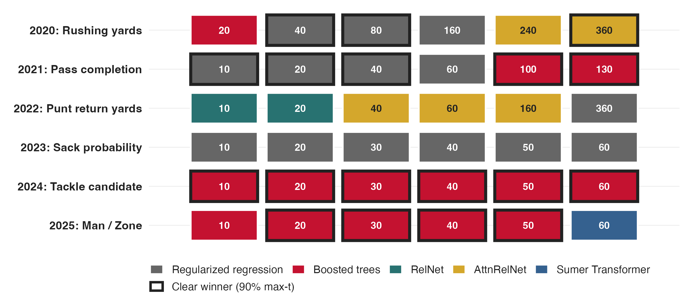{fig-alt="A matrix spanning six problems and six training sample sizes. Cell color identifies the model with the lowest observed mean loss. A dark outline marks the 18 cells where all four paired 90% max-t intervals across the problem favor that model." width="96%"}

::: {.notes}
**Talk track.** The same encoding now covers all six problems. Rushing itself moves from boosted trees to regularized regression to relational attention as the sample grows. Completion crosses from regularized regression to boosted trees. Tackle candidates favor boosted trees throughout. Punt return and sack rankings remain too close to identify a clear winner. Man/Zone identifies boosted trees as the clear winner from 20 through 50 games, while the Sumer Transformer has the lowest observed mean at 60 games without clearing the simultaneous comparison. The ranking depends on both the football problem and the amount of data.

**Timing.** 1:10.

[Sources]

- Paired inference at 90%: `data/inference_90/bdb2020/` through `data/inference_90/bdb2025/`.
- Derivation and source checksums: `data/inference_90/provenance.json`.
- Figure: `scripts/presentations/cassis2026/build_figures.R` / ggplot2.
:::

## Limitations and next steps {.limitations-slide}

::: {.limitations-content}

Across these problems, we only evaluate predictions at a single selected moment.

<ul class="limitations-next-steps">
  <li class="fragment" data-fragment-index="0"><strong>An illustrative extension:</strong> instead of predicting rushing yards only at handoff, update the forecast throughout the run.</li>
  <li class="fragment" data-fragment-index="1"><strong>Accuracy:</strong> how should performance be evaluated across repeated predictions?</li>
  <li class="fragment" data-fragment-index="2"><strong>Uncertainty:</strong> coverage at one time does not guarantee coverage throughout the play. Protecting the full sequence may require wider intervals.</li>
</ul>
:::

::: {.notes}
**Talk track.** Across all six problems, we evaluate predictions at one selected moment. For rushing, imagine updating the yardage forecast throughout the run. That requires evaluating accuracy across repeated predictions and coverage over the whole sequence. Intervals may need extra width relative to pointwise coverage, even though later intervals can still narrow as information arrives.

**Delivery.** The initial statement applies even when the input includes earlier tracking history. Rushing is an illustration of repeatedly updating predictions over time, not a single forecast of a player's future trajectory. This is a proposed extension, not a completed analysis. Move directly from this limitation to the conclusions.

**Timing.** 0:25.

[Sources]

- Research direction: Ron discussion notes, September 4, clarified as repeated prediction over time.
:::

## Conclusions {#evaluating-predictive-models .closing-slide}

  
How do we evaluate the quality of a predictive model?

  <ul class="closing-points">
    <li class="fragment" data-fragment-index="0"><strong>Accuracy is only one aspect of quality.</strong> We also care about the coverage and informativeness of prediction intervals (sets), as well as variability across samples.</li>
    <li class="fragment" data-fragment-index="1">The “<strong>best</strong>” model class depends on the problem, the number of training games, and the evaluation criterion.</li>
    <li class="fragment" data-fragment-index="2">With limited sample, the practical question is how much flexibility the available data can support.</li>
  </ul>

::: {.notes}
**Talk track.** How do we evaluate the quality of a predictive model? Accuracy is only one aspect. We also care about the coverage and informativeness of prediction intervals (sets), as well as variability across samples. Prediction intervals concern outcomes, while repetitions expose variability in fitted models and performance. The “best” model class depends on the problem, the number of training games, and the criterion. With limited sample, the practical question is how much flexibility the available data can support.

**Delivery.** Distinguish the sources of variation. The repetitions vary the full training, calibration, and evaluation procedure, so their spread is not solely an estimate of training-sample variance. Coverage and informativeness concern prediction intervals or sets for outcomes, not confidence intervals for model parameters. The empirical conclusion is that model rankings depend on the problem, training sample size, and criterion, rather than that any model class generally wins. Many observations share a play and a game. Game counts describe that sampling structure, not a calculated effective sample size. The results do not establish which model class would prevail with larger datasets.

**Timing.** 0:35. Combined ending: 1:00. Begin with the question alone, then reveal one complete bullet per click. Finish with all three visible.

[Sources]

- Terminal BDB2020 harmonized summaries underlying slides 15–17: `data/bdb_suite_runs/definitive/bdb2020_rushing_harmonized/full100/final/`.
- Paired inference at 90% underlying slides 15–18: `presentations/cassis2026/data/inference_90/bdbYYYY/` (`supported_best.csv` and `paired_contrasts.csv`). BDB2020 coverage qualification and controlled sharpness also use 90% confidence in that directory. Paths here are relative to the repository root.
- BDB2023 terminal metrics: `results/bdb/full100_serial_bdb2023_attempt1/final/primary_metrics.csv`.
- Cross-problem means: BDB2021–BDB2022 `presentations/cassis2026/data/raw_terminal/bdbYYYY/primary_metrics.csv`; BDB2024–BDB2025 `results/bdb/full100_serial_bdbYYYY_attempt1/final/primary_metrics.csv`.
- Figure source mapping and checksum verification: `scripts/presentations/cassis2026/build_figures.R`.
:::

## {.backup-divider .centered}

Backup

<a href="#/backup-rushing-curves">Additional results</a><a href="#/backup-rushing-inputs">Model inputs</a><a href="#/backup-conformal">Statistical details</a>

## Full BDB2020 learning curves {#backup-rushing-curves .backup-slide .figure-only}

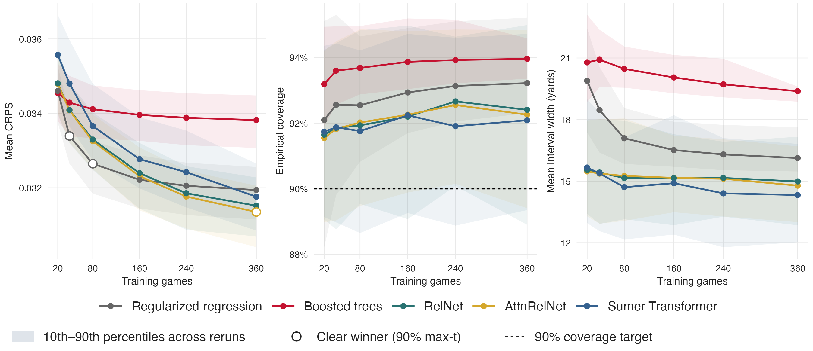{fig-alt="All BDB2020 CRPS, empirical coverage, and interval width learning curves across five models and six training sample sizes. Open circles on the CRPS panel identify clear accuracy winners under the 90 percent max-t comparisons." width="100%"}

::: {.notes}
[Sources] `data/bdb_suite_runs/definitive/bdb2020_rushing_harmonized/full100/final/summary.csv`; clear winners from `data/inference_90/bdb2020/supported_best.csv`; figure from `scripts/presentations/cassis2026/build_figures.R` / ggplot2. Ribbons span the 10th through 90th percentiles across complete repetitions. Open circles indicate clear winners for primary loss, not coverage or interval width.
:::

## BDB2025: Predicting Man or Zone before the snap {.backup-slide .figure-only}

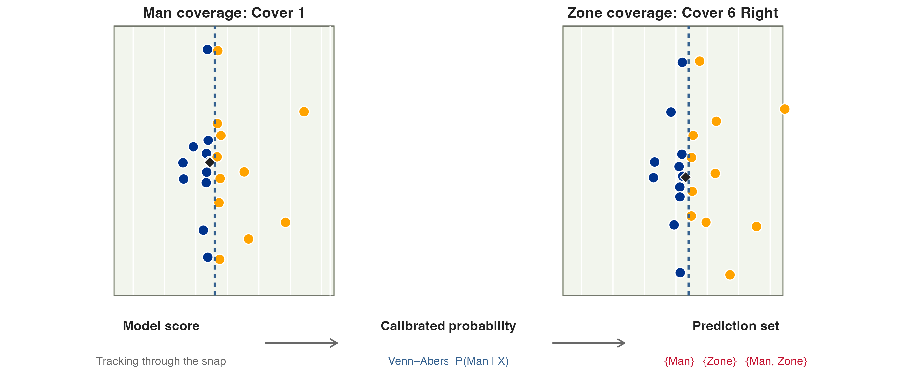{fig-alt="Two genuine Buffalo versus Los Angeles plays shown before the snap, one labeled Man Cover-1 and one labeled Zone Cover-6 Right, followed by the possible class-conditional conformal prediction sets." width="96%"}

::: {.notes}
**Talk track.** These are two actual labeled plays. The model produces a score from tracking through the snap. Venn–Abers maps that score to a calibrated probability of Man. Class-conditional conformal calibration separately turns the raw score into a prediction set: Man only, Zone only, or both labels.

[Sources]

- Task and uncertainty methods: `configs/bdb_suite/tasks/bdb2025_man_zone.json`.
- Actual plays: Game 2022090800, Plays 1563 and 2979.
- Provenance: `data/examples/bdb2025_man_zone_actual_plays_provenance.json`.
- Figure: `scripts/presentations/cassis2026/build_figures.R` / ggplot2.
:::

## Man/Zone accuracy and ranking stability {.backup-slide .figure-only}

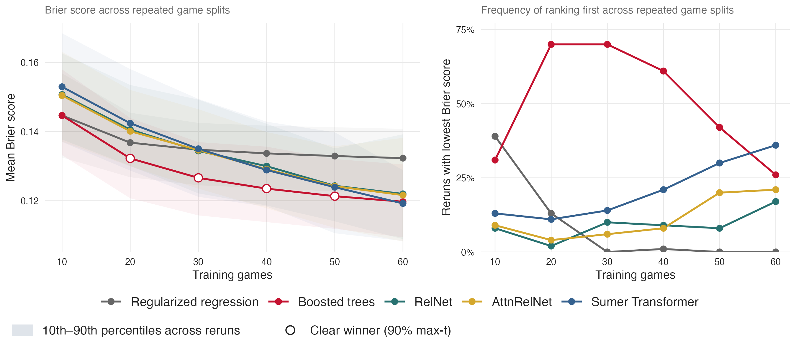{fig-alt="Mean Brier score and the share of 100 repetitions of the game splits in which each model ranks first across all six Man Zone training sample sizes. Open circles identify boosted trees as the clear accuracy winner at 20, 30, 40, and 50 games under 90 percent max-t comparisons. The Sumer Transformer has the lowest mean at 60 games, without a clear winner." width="99%"}

::: {.notes}
**Talk track.** Boosted trees have the lowest mean Brier score from 20 through 50 games and are the clear winner at 20 through 50 under the 90% max-t comparisons. At 60 games, the Sumer Transformer has the lowest observed mean but ranks first in only 36% of repetitions, and no model clears the max-t comparison.

[Sources]

- Terminal metrics: `results/bdb/full100_serial_bdb2025_attempt1/final/primary_metrics.csv`.
- Inference: `data/inference_90/bdb2025/supported_best.csv`.
- Figure: `scripts/presentations/cassis2026/build_figures.R` / ggplot2.
:::

## Clear winners across problems and sample sizes {#backup-winner-counts .backup-slide .figure-only}

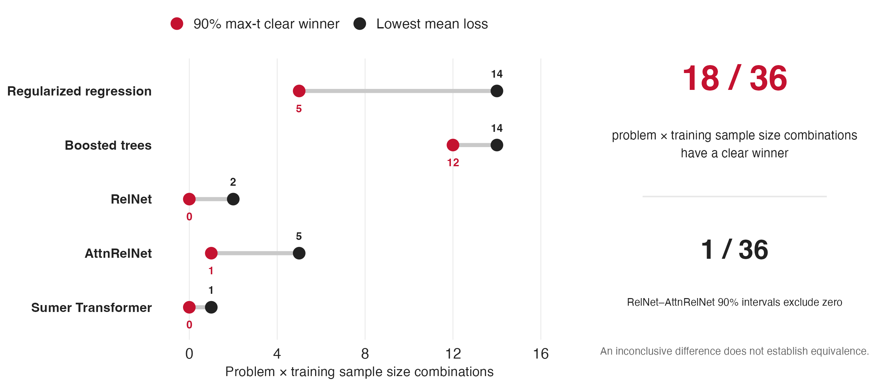{fig-alt="For each model class, a horizontal comparison shows how often it has the lowest observed mean loss and how often the results identify a clear winner under paired 90 percent max-t comparisons across each problem. Eighteen of 36 combinations of problem and sample size identify a clear winner. One of 36 matched RelNet versus AttnRelNet comparisons excludes zero." width="97%"}

::: {.notes}
**Talk track.** Point estimates always produce a leader, but only 18 of the 36 combinations of problem and sample size identify a clear winner under the 90% max-t rule across each problem. Boosted trees and regularized regression each lead 14 times; they clear the criterion 12 and five times, respectively. AttnRelNet leads five times and clears it once, while RelNet and the Sumer Transformer lead three cells between them without clearing the criterion. One of the 36 tightly matched RelNet–AttnRelNet intervals excludes zero: BDB2020 at 360 games. An inconclusive comparison does not establish equivalence.

[Sources]

- Same max-t inference tables as the main ranking slide.
- RelNet–AttnRelNet paired contrasts at 90%: `data/inference_90/bdbYYYY/paired_contrasts.csv`; derivation recorded in `data/inference_90/provenance.json`.
- Counts independently audited against all terminal tables and checksum sidecars.
- Figure: `scripts/presentations/cassis2026/build_figures.R` / ggplot2.
:::
## Rushing inputs at handoff {#backup-rushing-inputs .backup-slide .exact-features}

::: {.backup-content}

<strong>One handoff frame.</strong> 22 observed players, centered on the rusher and oriented in the offense's direction.

Play context

Down, yards to go, clock, field position, and score before the play Formation, personnel, and defenders in the box

Tracking

Player positions, velocity, speed, acceleration, direction, and orientation Offense/defense and position group indicators

Engineered features

Position and motion summaries by side Distances between offensive and defensive players and distances from the rusher to other players

Neural input

1 frame × 23 slots × 24 channels The football slot is unused and masked

:::

::: {.notes}
[Sources] `configs/bdb_suite/tasks/bdb2020_rushing_harmonized.json`; `bdb_study/representations.py`. Channels and masks follow the common tensor interface. The 2020 release has 22 player observations at handoff and no observed football token.
:::

## Man/Zone inputs through the snap {#backup-manzone-inputs .backup-slide .exact-features}

::: {.backup-content}

<strong>20 frames × 23 objects × 24 channels.</strong> Players and football, centered on the football and oriented in the offense's direction.

Play context

Down, yards to go, clocks, field position, and score before the snap Win probability, expected points, formation, and receiver alignment

Location and motion 6 channels

x, y, horizontal and vertical velocity, speed, acceleration

Angles and object roles 8 channels

Sine and cosine of direction and orientation Indicators for offense, defense, football, and the focal player

Position groups 10 channels

QB, RB, WR, TE, OL, DL, LB, DB, special teams, other

Separate masks track missing players and frames padded on the left. Primary models exclude player and team identity.

:::

::: {.notes}
[Sources] Exact BDB2025 fields: `configs/bdb_suite/tasks/bdb2025_man_zone.json`. Deterministic tabular summaries: `bdb_study/representations.py`, `token_summary_frame()` and `relational_summary_frame()`. Tabular models receive summaries from the final frame and movement and spacing summaries across frames. Masks are separate from the 24 channels.
:::

## Matched model comparisons {#backup-model-matching .backup-slide}

:::: {.backup-content .backup-sections}
::: {.backup-section}
<h3>Regularized regression vs boosted trees</h3>

The same engineered football features. Only the learning algorithm changes.
:::

::: {.backup-section}
<h3>RelNet vs AttnRelNet</h3>

The same tracking, graph, temporal encoder, output head, loss, tuning, seeds, and training protocol.

Mean aggregation vs learned attention weights.
:::

Neural matching tolerances: <strong>5% in parameter count</strong> and <strong>15% in FLOPs</strong>. These constrain computational differences but do not establish equivalence.

::::

::: {.notes}
[Sources] `paper/methods-brief.tex`; `bdb_study/models.py`; `bdb_study/representations.py`.
:::

## Conformal coverage and the sampling unit {#backup-conformal .backup-slide}

::: {.backup-content}

  
Prediction

Calibration unit

Interpretation

  
Yard interval

One selected play per calibration game

Marginal coverage for one eligible play from a new comparable game

  
Binary set

One selected example per game and true label

Coverage calibrated separately for each label

  
Repeated predictions (next step)

Sequence calibration design to be specified

Target: simultaneous coverage across prediction times

The completed analyses require exchangeability at the calibration unit. Coverage is marginal over comparable games, not a guarantee for every play or every subgroup.

:::

::: {.notes}
[Sources] `paper/methods-brief.tex`; @angelopoulos2023conformal.
:::

## Max-t intervals across a problem {#backup-max-t-method .backup-slide}

:::: {.backup-content .backup-sections .backup-inference}
::: {.backup-section}
<h3>Paired loss differences</h3>

Comparison $j$ is a model pair trained on the same number of games. Across 100 repetitions, $\bar d_j$ is the mean loss difference and $s_j$ its standard error.
:::

::: {.backup-section}
<h3>Resample complete repetitions</h3>

Each of 10,000 bootstrap draws resamples 100 repetition vectors, keeping all 60 comparisons together. Compute the bootstrap mean $\bar d_j^*$ and standard error $s_j^*$, then record

$$
M^*=\max_{j=1,\ldots,60}\left|\frac{\bar d_j^*-\bar d_j}{s_j^*}\right|
$$
:::

::: {.backup-section}
<h3>Simultaneous 90% intervals</h3>

Use the 90th percentile of $M^*$ for $c$, with the ordinary two-sided 90% $t$ critical value as a lower bound.

$$
\mathrm{CI}_j=\bar d_j\pm c\,s_j
$$

The family covers all model pairs and training sample sizes within one problem.
:::
::::

::: {.notes}
[Sources] `data/inference_90/provenance.json` and `data/max_t_90_sensitivity/provenance.json`, following `bdb_study/analysis.py`, `paired_max_t_intervals()`, with the confidence level set to 90%. The implementation uses the higher empirical quantile, guards against degenerate standard errors, and retains the ordinary t critical value as a lower bound. The same 10,000 complete-repeat bootstrap draws reproduce the frozen terminal inference before evaluating the 90% cutoff. These intervals characterize comparisons produced by repeating the procedure on the available cohort, not unrestricted generalization to a new population.
:::

## Example of simultaneous model comparisons {#backup-max-t-example .backup-slide .figure-only}

::: {.backup-figure-group}

<strong>2021: Pass completion, 10 training games</strong>

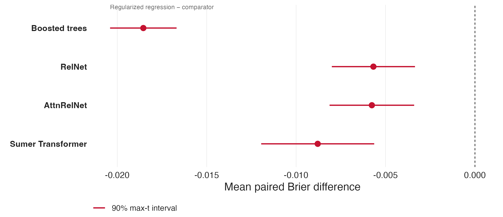{fig-alt="BDB2021 at 10 games: four 90 percent max-t confidence intervals for Linear-Structure minus each comparator, all below zero. Complete repetition resampling preserves dependence across the family of 60 comparisons." width="94%"}
:::

::: {.notes}
**Interpretation.** Negative differences favor regularized regression. All four 90% max-t intervals lie below zero. The adjustment covers the full family of 60 comparisons within the problem.

[Sources] `data/inference_90/bdb2021/paired_contrasts.csv` and `supported_best.csv`; figure from `scripts/presentations/cassis2026/build_figures.R` / ggplot2.
:::
